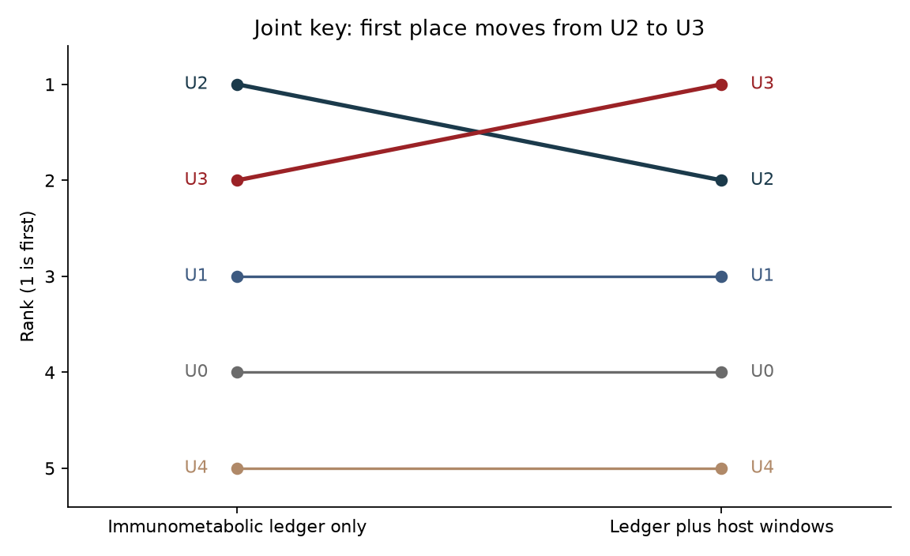
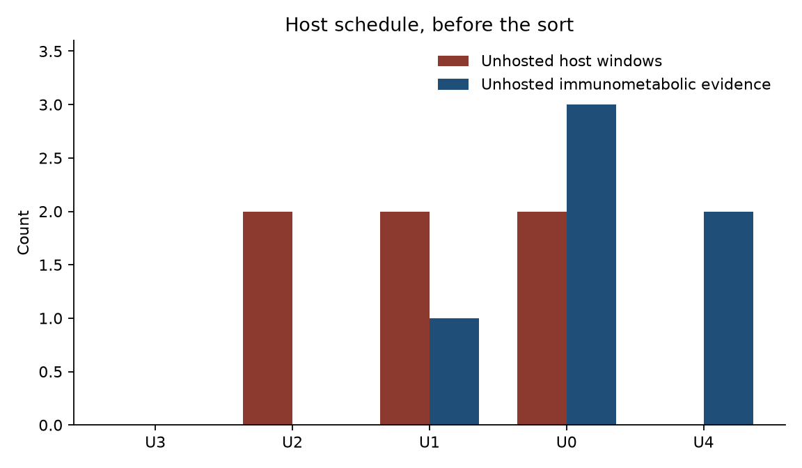
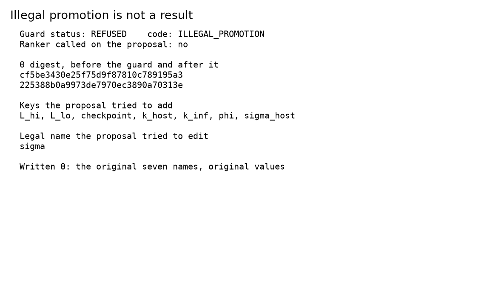

# Host infection windows that re-rank immunometabolic hypothesis structures without entering Θ

**Thesis #23. Computational research thesis**  
**Author:** Kelechi Emeka Ogbonna  
**Correspondence:** kelechiogbonna300@gmail.com · https://github.com/cloudynirvana/thesis-23-host-ranked-immunometabolic-hypotheses  
**Date:** 21 September 2026  
**Format:** B.Sc. project chapters (Nile University style), written as a computational methods manuscript  
**Depends on:** Thesis #10 (immunometabolic refuse-as-parameter) and Thesis #14 (infection × residual-burden delayed-risk graph)  
**Status:** A joint ranking on declared structure records. Not an integration of Thesis #10. Not a propagation of Thesis #14.  
**Citation style:** numbered Vancouver. A `doi:` field appears only where Crossref returned the record.  
**DOI:** none for this document. Do not invent one.

---

## Title page

**HOST INFECTION WINDOWS THAT RE-RANK IMMUNOMETABOLIC HYPOTHESIS STRUCTURES WITHOUT ENTERING Θ**

BY

**KELECHI EMEKA OGBONNA**

A COMPUTATIONAL RESEARCH THESIS  
(JOINT RANK OF DECLARED STRUCTURE RECORDS)

SUBMITTED AS A CITEABLE MANUSCRIPT FOR JOURNAL / THESIS HANDOFF

PROJECT CONFLUENCE  
INDEPENDENT COMPUTATIONAL RESEARCH

SUPERVISOR: not appointed for this deposit

SEPTEMBER 2026

---

## Declaration

I, Kelechi Emeka Ogbonna, declare that this computational research thesis was carried out by me. The ranks, the sensitivity orders, and the refusal recorded here were produced by `sim/joint_rank.py` at seed 20260921. They are not wet-lab measurements and not patient outcomes. The kinetic values and the two windows are inherited declarations from Thesis #10 and Thesis #14. They were not fitted in this deposit. No DOI, ORCID, or journal acceptance was invented for this document.

_________________________     _______________________  
Kelechi Emeka Ogbonna         Date

---

## Abstract

Can declared infection/host delay windows change the rank order of immunometabolic hypothesis structures while both the windows and the immunometabolic non-parameters stay outside Θ?

Five structure records share one frozen kinetic vector of length 7. The ranker does not receive that vector. Immunometabolic evidence sits on a ledger: a tight lactate band, a checkpoint label, and a host supply budget. Host evidence is two declared windows on a model clock, an infection interval [1.5, 2.5] and a marrow-stress-like interval [10, 12]. With the ledger alone, the joint key returns U2, U3, U1, U0, U4, so the checkpoint-scaled record is first. Attaching the two windows, and changing nothing else, returns U3, U2, U1, U0, U4, so the windowed checkpoint record is first. A key that ignores the windows still returns U2 first on the host schedule. A key that reads structural size before unhosted windows also leaves U2 first. A key that drops the lactate-band mask ranks the band-bypass record first. The joint key leaves that record last.

A separate map offers to replace the kinetic supply 0.12 with the host budget 0.20, and to add the checkpoint scale, the band endpoints, the checkpoint label, k_inf = 1/2, and k_host = 1/9. The guard returns REFUSED and does not call the ranker. SHA-256 of the canonical JSON for Θ is cf5be3430e25f75d9f87810c789195a3225388b0a9973de7970ec3890a70313e before the guard and after it. No ordinary differential equation was integrated. No delay graph was propagated. The windows are declared. They are not a cohort. Research only. Not a medical device, not a dose, and not a cure.

---

## Keywords

immunometabolism; hypothesis rank; host infection window; lactate band; checkpoint proxy; non-parameter; refuse-as-parameter; temporal constraint; identifiability boundary; toy model; research only

---

## Table of Contents

DECLARATION  
ABSTRACT  
Table of Contents  
List of tables and figures  

CHAPTER ONE. INTRODUCTION  
1.1 Background to the study  
1.2 STATEMENT OF RESEARCH PROBLEM  
1.3 JUSTIFICATION OF STUDY  
1.4 AIM AND OBJECTIVES OF THE STUDY  
1.5 SIGNIFICANCE OF THE STUDY  
1.6 SCOPE OF THE STUDY  

CHAPTER TWO. LITERATURE REVIEW  
2.1 Immunometabolic structure is already a refusal problem  
2.2 Infection context is already a ranking problem on a different object  
2.3 A joint key is neither of those calculations  
2.4 What a promotion would have to write  

CHAPTER THREE. MATERIALS AND METHODS  
3.1 Design  
3.2 Four stores  
3.3 Five structure records  
3.4 Two evidence schedules  
3.5 The joint key and three other keys  
3.6 The promotion that is refused  
3.7 What was not done  

CHAPTER FOUR. RESULTS  
4.1 The ledger alone leaves U2 first  
4.2 The windows move first place to U3  
4.3 Two keys that do not move first place  
4.4 Dropping the band mask would promote U4  
4.5 The refusal, and the digest  
4.6 The order does not follow the input row  

CHAPTER FIVE. DISCUSSION, CONCLUSION AND RECOMMENDATION  
5.1 Discussion  
5.2 Conclusion  
5.3 Recommendation  

REFERENCES  
DISCLAIMER  

---

## List of tables and figures

**Table 3-1.** Stores.  
**Table 3-2.** Legal kinetic values in Θ.  
**Table 3-3.** Ledger constants. These are not in Θ.  
**Table 3-4.** Declared host windows.  
**Table 3-5.** Structure records.  
**Table 3-6.** Evidence schedules.  
**Table 3-7.** Sort terms of the joint key.  
**Table 4-1.** Rows under the immunometabolic schedule.  
**Table 4-2.** Rows under the host schedule.  
**Table 4-3.** Orders under four keys.  
**Table 4-4.** The refused proposal.

**Figure 4-1.** Rank under the joint key, ledger alone and ledger plus host windows.  
**Figure 4-2.** Unhosted counts on the host schedule, before the sort.  
**Figure 4-3.** Digest and refused keys.

Figures are diagnostics from `sim/joint_rank.py`. They are not measured cohorts.

---

# CHAPTER ONE

## 1.0 INTRODUCTION

### 1.1 Background to the study

Tumour-immune dynamics have a standard mathematical shape. A burden grows, an effector population kills, and the parameters of that pair are what a fit is asked to recover [1–5]. Metabolism enters the same pictures as a second story. Warburg's aerobic glycolysis, and the later reviews of it, give lactate a role in the life of a proliferating cell [6–9]. The immunology that followed is more specific than a hallmark heading. Tumour-derived lactic acid suppresses T cells, polarises macrophages, and is discussed as a brake on surveillance [10–13]. Parallel reviews treat T-cell activation itself as a metabolic programme, with checkpoints that are biochemical before they are therapeutic names [14–16].

Checkpoint language then became a modelling temptation of its own. Blockade reviews describe exhaustion and primary, adaptive, and acquired resistance [17–20]. Hallmark lists place immune evasion next to metabolic reprogramming [21]. The cancer-immune set point, T-cell exclusion, and the tumour immune microenvironment are ways of saying that the host tissue around a lesion is part of the description [22–24]. None of those reviews is a parameter vector. Each of them can be misread as one.

Infection is a second host fact, older than the checkpoint papers. A fraction of the global cancer burden is attributed to infection [25]. Inflammation is reviewed as a partner of tumour promotion [26,27]. Leukocyte count and infection were already paired in acute leukaemia in 1966 [28]. Severe infection is also described as a collapse of host immune function [29]. More recent microbial papers report that commensal composition sits next to differences in immunotherapy response [30–32]. The step from that sentence to a rate constant is short, and it is the step this thesis refuses.

Two earlier deposits already refuse neighbouring steps, and they refuse them on different objects. Thesis #10 keeps lactate, a checkpoint scale, and a host supply budget out of a seven-coordinate kinetic vector, and it lets those objects change which immunometabolic structure ranks first [33]. The calculation there is an integrated cartoon and a scaled residual. Thesis #14 keeps infection and marrow-stress-like windows out of a pharmacokinetic triple, and it lets those windows change which delayed-risk graph ranks first [34]. The calculation there is a difference-constraint propagation. Identifiability theory is the reason both refusals matter. A symbol that enters Θ is a symbol a later fit may claim to have estimated [35–37]. A symbol that stays outside is evidence, syntax, or a mask. May's warning, and the modelling manifesto that followed it, apply before any of those symbols is given a biological name [38,39].

The gap between the two deposits is narrow and it is the whole of this thesis. Thesis #10 ranks immunometabolic structures from immunometabolic evidence. Thesis #14 shows that infection windows can re-rank a delay graph. Neither deposit asks whether those windows can re-rank the immunometabolic structures while the windows and the immunometabolic non-parameters both remain outside Θ.

### 1.2 STATEMENT OF RESEARCH PROBLEM

Can declared infection/host delay windows change the rank order of immunometabolic hypothesis structures while both the windows and the immunometabolic non-parameters stay outside Θ?

The working form is a ledger, not a differential equation. There are five structure records. There is one kinetic vector, frozen, of length 7. There is one immunometabolic ledger, with a lactate band, a checkpoint label, a checkpoint scale, and a supply budget. There are two host windows. There is one joint sort key, written in the script before the ranks are read, and three other keys that exist so the primary order can fail in public. The question is whether attaching the windows changes the first place under the joint key, whether the keys that ignore the windows or that demote them leave the first place where it was, and whether a map from the ledger and the windows into Θ is refused.

A familiar way to miss the question is to answer it by re-integrating Thesis #10, or by re-propagating Thesis #14. Those calculations have already been published [33,34]. Another way to miss it is to treat the new first place as a mechanism. U3 hosts the windows because the record says so. Hosting is syntax.

### 1.3 JUSTIFICATION OF STUDY

Thesis #10 can change an immunometabolic rank with a checkpoint label and a lactate band, and the kinetic vector stays length 7 [33]. The evidence store in that deposit has no infection window. Thesis #14 can change a delayed-risk rank by attaching an infection window and a marrow-stress-like window, and the pharmacokinetic triple is unread [34]. The hypotheses in that deposit are temporal networks on residual burden. They are not immunometabolic structure records. A reader who has both papers still does not know whether host timing can reorder the immunometabolic family without becoming a clearance, an elimination rate, or an eighth kinetic name.

The study is justified as that missing joint question. The kinetic values, the ledger constants, and the window endpoints are taken as literals from the two deposits so that the only new operation is the rank. Chapter Four is that operation. It is not a second copy of either result table.

The study is also justified by the ease of the collapsed sentence. A modeller can write "host infection" in a discussion and, two lines later, a symbol k_inf inside the fitted vector. Cachexia reviews already treat the host as a constraint on what a tumour model may assume about supply [40]. That constraint is a reason for a budget on a ledger. It is not a reason to copy the budget onto a kinetic name. The guard in Section 3.6 is the test of that distinction [38,39].

### 1.4 AIM AND OBJECTIVES OF THE STUDY

The aim is to test whether declared infection and host windows change the rank order of immunometabolic structure records under a predeclared joint key, while the windows and the immunometabolic non-parameters remain outside Θ.

The objectives are:

1. Freeze the seven kinetic values and publish the SHA-256 digest of their canonical JSON.
2. Define five structure records by slots and by immunometabolic mask flags, without integrating a right-hand side.
3. Rank the records on the immunometabolic ledger alone, and again after the two host windows are attached.
4. Report three other keys: immunometabolic terms only, windows demoted to a tie-break after size, and a window-only sort that drops the band mask.
5. Refuse a proposal that edits the kinetic supply and that adds ledger constants and window-derived keys to Θ.
6. Keep dosing, care pathways, and any reading of rank 1 as a treated cohort outside the aim.

Non-aims. Re-estimating the kinetic vector. Recomputing the scaled residuals of Thesis #10. Re-running the difference-constraint propagation of Thesis #14. Mapping a window midpoint onto a clearance. Interpreting a slot as an assay.

### 1.5 SIGNIFICANCE OF THE STUDY

The useful product is a rank that can fail in public. If the host schedule had returned the same first place as the ledger-only schedule, the claim that these windows re-rank this family would fail on this toy. If the immunometabolic-terms key had moved first place when the windows were attached, the claim that the move is the window term would fail. If the guard had written σ = 0.20, or k_inf, the claim that both classes of object stay outside Θ would fail. Those checks can be rerun without accepting a clinical sentence [38,39].

There is a second product inside the same script. U4 hosts both windows and remains last under the joint key, because its lactate-band flag is false. A window-only sort puts U4 first. The mask is what stops infection context from rehabilitating a record the immunometabolic ledger has already excluded.

What the significance is not: a rule for sequencing an antimicrobial with an immunotherapy, a lactate target, or a replacement for the tumour-immune reviews [1–5,17–20].

### 1.6 SCOPE OF THE STUDY

In scope. Five declared records. Two evidence schedules. One frozen vector. One joint key and three comparison keys. Two hundred input permutations at seed 20260921. One refused proposal.

Out of scope. Ordinary differential equations. Delay graphs and Floyd-Warshall propagation. Profile likelihoods and structural-identifiability software. Human or animal series. Drug inputs. Any identification of a window with a hospital day or a treated cohort.

---

# CHAPTER TWO

## 2.0 LITERATURE REVIEW

### 2.1 Immunometabolic structure is already a refusal problem

The classical tumour-immune equations put growth, carrying capacity, kill, supply, and clearance in one vector, and they treat that vector as the object a data set might identify [1–3,5]. Later metabolic reviews give names to processes a vector of that kind does not contain. Lactate is an observation with a literature, from Warburg through the macrophage and T-cell papers [6,10–13]. It is also a convenient extra coefficient: a term in which lactate multiplies effector loss, with a new Greek letter in front. Checkpoint status is a label in the clinical reviews [17,19,20]. It is also a convenient multiplier on kill. Host supply is a biological constraint in the cachexia literature and in the broader microenvironment reviews [23,24,40]. It is also a convenient replacement for the supply coordinate already in the vector.

Thesis #10 is the refusal of those three conveniences on a toy [33]. The legal vector there is

Θ = (r, K, κ, σ, δ, π, λ),

with the numerical literals used again in Table 3-2 of this thesis. A second structure scales kill by a ledger constant φ = 0.55. A host budget requires σ ≤ 0.20. A lactate band, loose or tight, masks structures whose terminal lactate falls outside it. Rank inside the admissible set is a scaled residual on synthetic series. The checkpoint label changes which structure is first. The tight band then removes the scaled-kill structure despite a small residual. A fit that adds a lactate-suppression coefficient improves the residual and is still refused as a write into Θ.

That paper answers its own question. It does not answer this one. Its evidence store has a checkpoint label and a band. It has no infection window and no marrow-stress-like window. The residual it ranks by is an integral of a right-hand side. This thesis does not recompute that integral, and it does not quote those residuals as its ranks.

### 2.2 Infection context is already a ranking problem on a different object

Competing-risk and multi-state methods exist because two waits on one person are not two independent clocks [41–43]. Temporal constraint networks exist because a set of interval bounds can be tightened, or shown empty, without inventing a rate [44]. Thesis #14 uses the second of those traditions on a small graph [34]. Four hypotheses are syntax: delay bounds among an origin, an infection-like mark, a marrow-stress-like mark, a residual-burden mark, and a relapse-like mark. Evidence windows live in another store. A third store holds Θ = (CL, V, ke) = (1.2, 8.0, 0.15). The ranker does not read it. With burden windows only, the order is H0, H1, H3, H2. With an infection window [1.5, 2.5] and a marrow-stress-like window [10, 12] attached, the order is H2, H1, H0, H3. A map from the window midpoints onto k_inf, k_host, CL, and ke is refused. The digest of the pharmacokinetic triple does not change.

That paper answers its own question. The hypotheses are delay graphs. They are not the immunometabolic structures of Thesis #10. The Θ in that paper is a clearance, a volume, and an elimination rate. The Θ in this paper is the seven kinetic names. The digest in Chapter Four is therefore a different string, of a different object. The windows are the same declared intervals, used here as slots on structure records rather than as difference constraints. No edge of Thesis #14 is propagated in `sim/joint_rank.py`.

### 2.3 A joint key is neither of those calculations

A joint question can still be asked without repeating either algorithm. A structure record can declare which immunometabolic evidence identifiers it hosts, and which host-window identifiers it hosts. Admissibility can be a column of flags, inherited as syntax from the ledger idea, rather than a terminal lactate taken from a new integration. Unhosted evidence can be counted. A sort can read the immunometabolic mask first, then the unhosted windows, then the unhosted immunometabolic identifiers, then the number of slots.

That sort is a lexicographic key. It is in the same family as the key in Thesis #14, which counts unexplained evidence before a complexity penalty [34]. It is not that key. There is no feasible-window volume, because there is no propagation. There is no residual sum of squares, because there is no trajectory [33]. The records U0–U4 are not M_base, M_ck, and M_supply, and they are not H0–H3.

The priority inside the key is part of the object. If unhosted windows are counted before size, a record that hosts the windows can pass a smaller record that leaves them unexplained. If size is counted first, the smaller record can stay ahead even though the windows sit unhosted. Section 3.5 writes both priorities. Chapter Four reports both orders. The result is the pair, not a claim that every sort would move.

Microbial and inflammatory papers make the priority matter [26,27,29–32]. They give host context a place in the narrative of response. A narrative place is not a slot. A slot is a declared identifier. The key can see an identifier. It cannot see a paragraph.

### 2.4 What a promotion would have to write

Promotion, in the sense used here, is a write. The legal names are the seven keys of Θ. A proposal promotes when it adds a key, or when it changes a legal value. The added key might be a ledger constant: φ, the band endpoints, the host budget, the checkpoint label. The added key might be a reciprocal of a window midpoint, or a reciprocal of the gap between two midpoints. The changed value might be the kinetic supply, overwritten by the host budget. Any one of those writes is enough.

Identifiability is the reason the write is the wrong place for them [35–37]. Once a symbol is inside Θ, a later numerical rank, profile, or fit can be narrated as an estimate of that symbol. The ledger and the windows are not estimates. They are declarations. Thesis #10 already refused φ and the band as members of the kinetic vector [33]. Thesis #14 already refused window reciprocals as members of a pharmacokinetic triple [34]. This thesis asks the guard to refuse both families in one proposal, aimed at the kinetic vector, and to leave the ranker uncalled.

Nothing in that refusal is a dosing rule. The reciprocals are computed so the guard has a concrete map to reject. They are stored under `proposal_not_a_result`. They do not enter the sort.

---

# CHAPTER THREE

## 3.0 MATERIALS AND METHODS

### 3.1 Design

The study is a deterministic ranking of declared records. No series comes from a patient, a mouse, or a cell-culture plate. Literature in Chapter Two motivates the names of the stores. It does not supply the ranks in Chapter Four.

Code and outputs are `sim/joint_rank.py` and `sim/results.json`. Seed 20260921 is used for the permutation audit in Section 3.5. The rank itself does not draw random numbers. The kinetic literals and the ledger literals are those of Thesis #10 [33]. The window endpoints are those of the host schedule in Thesis #14 [34]. They are inputs. The orders below are not copied from either paper.

### 3.2 Four stores

**Table 3-1.** Stores. Only the host-window store changes between the two schedules. Θ does not. The ledger does not. The structure syntax does not.

| Store | Contents | Read by the ranker | Written by evidence |
| --- | --- | --- | --- |
| Syntax | Slots and mask flags of U0–U4 | Yes | No |
| Immunometabolic ledger | Band, checkpoint label, φ, supply budget | Yes, as a mask and as unexplained identifiers | No |
| Host windows | W_I and W_M, each with an identifier | Yes, if the schedule contains them | The schedule is this store |
| Θ | Seven kinetic values, Table 3-2 | No | No |

The digest of Θ is SHA-256 of the UTF-8 JSON object with keys sorted and no spaces. The canonical string is `{"K":1.2,"delta":0.25,"kappa":0.5,"lam":0.55,"pi":0.7,"r":0.3,"sigma":0.12}`. Section 4.5 records the digest and records it again after the guard.

**Table 3-2.** Legal kinetic values. Code names match the canonical JSON. These values were not fitted in this deposit [33].

| Symbol | Code name | Value | Role on the ledger's parent cartoon |
| --- | --- | --- | --- |
| r | r | 0.3 | growth coefficient |
| K | K | 1.2 | carrying capacity |
| κ | kappa | 0.5 | kill coefficient |
| σ | sigma | 0.12 | effector supply |
| δ | delta | 0.25 | effector clearance |
| π | pi | 0.7 | lactate production coefficient |
| λ | lam | 0.55 | lactate clearance |

The role column names the cartoon in Thesis #10. This script never evaluates that cartoon. φ does not multiply κ here. The column is a trace of where the literals came from.

**Table 3-3.** Ledger constants. These are not in Θ [33].

| Object | Symbol | Value | Use in this deposit |
| --- | --- | --- | --- |
| Checkpoint scale | phi | 0.55 | Stored. Not a coefficient. A key the guard is asked to refuse. |
| Host supply budget | sigma_host | 0.20 | Admissibility mask, and the value offered as an overwrite of σ |
| Tight lactate band | (L_lo, L_hi) | (0, 0.45) | The band the mask refers to. Endpoints are refused as keys. |
| Checkpoint label | checkpoint | present | Immunometabolic evidence identifier E_ck is in the store |

The immunometabolic evidence identifiers, present on both schedules, are E_lac, E_ck, and E_sup. They name the band, the checkpoint label, and the supply budget. A structure that does not list an identifier leaves it unhosted. Unhosted is a count. It is not a residual.

**Table 3-4.** Declared host windows, model time. A window absent from a schedule is not an unexplained object. A window whose identifier is missing from a record is unexplained. It is not dropped, and it is not copied into Θ [34].

| Identifier | Label | Interval |
| --- | --- | --- |
| W_I | infection | [1.5, 2.5] |
| W_M | marrow_stress | [10, 12] |

### 3.3 Five structure records

A record is admissible when three flags are true: the lactate-band flag, the supply-budget flag, and the checkpoint flag. The checkpoint flag is true for every record in this deposit, because none of them claims a checkpoint slot while the label is absent. U4 fails admissibility on the band flag alone. The flags are columns. They are not outputs of an integrator.

**Table 3-5.** Structure records. Slot lists are syntax.

| Id | Code name | Immunometabolic slots | Window slots | Inside band | Within budget |
| --- | --- | --- | --- | --- | --- |
| U0 | open_baseline | none | none | yes | yes |
| U1 | lactate_masked | E_lac, E_sup | none | yes | yes |
| U2 | checkpoint_scaled | E_lac, E_ck, E_sup | none | yes | yes |
| U3 | windowed_checkpoint | E_lac, E_ck, E_sup | W_I, W_M | yes | yes |
| U4 | band_bypass | E_ck | W_I, W_M | no | yes |

U2 and U3 carry the same immunometabolic slots. They differ by the two window slots. That is the contrast the joint key is built to see. U4 carries both window slots and fails the band. That is the contrast the mask is built to see. U0 hosts nothing. It remains admissible, and it pays for the empty slot list in the unexplained counts.

Slot count is the number of immunometabolic slots plus the number of window slots. U0 has 0, U1 has 2, U2 has 3, U3 has 5, and U4 has 3. Window slots count even on the ledger-only schedule. A record that declares them is a larger record when those windows are not in evidence.

### 3.4 Two evidence schedules

**Table 3-6.** Evidence schedules. The immunometabolic identifiers are present in both. Only the host-window store changes.

| Schedule | Host-window identifiers in evidence |
| --- | --- |
| Immuno only | none |
| Host | W_I, W_M |

The immunometabolic identifiers E_lac, E_ck, and E_sup are present in both. The host schedule adds two windows. It does not edit the ledger, the syntax, or Θ. On the ledger-only schedule every record has zero unhosted windows, because there is no window identifier to host.

### 3.5 The joint key and three other keys

**Table 3-7.** Sort terms of the joint key. The first term that differs decides the rank. Rank 1 is the preferred record.

| Priority | Term | Preferred value |
| --- | --- | --- |
| 1 | Admissibility | Admissible before inadmissible |
| 2 | Unhosted host windows | Fewer identifiers |
| 3 | Unhosted immunometabolic evidence | Fewer identifiers |
| 4 | Slot count | Fewer slots |
| 5 | Structure id | Lexicographic id, as a terminal tie-break |

The key is written in the script as `key_primary`, above the ranker. The ranker takes a list of rows and a key function. Its signature does not include Θ. Unhosted windows sit ahead of slot count so that a smaller record cannot outrank a record that actually hosts the windows. That priority is the same kind of choice Thesis #14 makes when it counts unexplained evidence before node count [34]. It is a choice. The tie-break key below records what happens when it is reversed.

Three other keys are computed on the same rows.

The immunometabolic-terms key drops priority 2. It is the ledger, the mask, and the size term. It is computed on the host schedule as well as on the ledger-only schedule. It exists because a bug that let the windows edit the ledger would move this order too.

The tie-break key keeps every term and swaps priorities 2 and 4, so slot count is read before unhosted windows. It is computed on the host schedule. It exists because the claim that the windows move first place depends on the priority in Table 3-7.

The window-only key drops admissibility and drops the immunometabolic unexplained term. Its sort is unhosted windows, then slot count, then id. It is computed on the host schedule. It exists because a reader might think that hosting W_I and W_M should be enough. U4 is the record that thought is about.

The permutation audit shuffles the five records and re-sorts, 200 times on each schedule, with NumPy's Generator at seed 20260921. A discordant shuffle is one whose primary order differs from the order of the unshuffled list. The rank does not use the draws.

### 3.6 The promotion that is refused

The refused map reads the ledger and the host windows. It does not read a likelihood. Midpoints are t_I = 2 and t_M = 11. From those two numbers and from Table 3-3 it builds a proposal that starts from the seven legal values and then:

- replaces σ = 0.12 with sigma_host = 0.20,
- adds phi = 0.55, L_lo = 0, L_hi = 0.45, sigma_host = 0.20, and checkpoint = present,
- adds k_inf = 1 / t_I = 1/2,
- adds k_host = 1 / (t_M − t_I) = 1/9.

The source of the new keys is the ledger and the windows. k_inf and k_host are not legal names. The edit to σ changes a legal value. Any one of those facts is enough for the guard. The guard records status REFUSED and code ILLEGAL_PROMOTION, returns Θ unchanged, and does not call the ranker. The proposal is stored under `proposal_not_a_result`.

A second call submits the original seven pairs and nothing else. That call is a name check. The status is NAMES_UNCHANGED. It is not a fit, and it is not the result in Section 4.5. It exists so the guard is not a function that refuses every input.

### 3.7 What was not done

No ordinary differential equation was integrated [1,33]. No delay graph was propagated, and no feasible-window volume was computed [34,44]. No profile likelihood was computed [36]. No structural-identifiability program was run [37]. Θ was not optimised. The band flags were not estimated from a lactate assay. The windows were not estimated from a registry. No dose and no care sequence was computed [39].

---

# CHAPTER FOUR

## 4.0 RESULTS

All orders in this chapter come from `sim/joint_rank.py`. They are computational. They are not patient outcomes. The ranker did not read Θ.

### 4.1 The ledger alone leaves U2 first

On the immunometabolic schedule the window store is empty, so every record has zero unhosted windows. The mask then removes U4. Among the admissible records, U2 and U3 both host E_lac, E_ck, and E_sup, so both have zero unhosted immunometabolic evidence. U2 has three slots and U3 has five. The size term places U2 first and U3 second. U1 leaves E_ck unhosted and is third. U0 leaves all three immunometabolic identifiers unhosted and is fourth. U4 is fifth.

**Table 4-1.** Primary rows, immunometabolic schedule. Rank 1 is preferred.

| Rank | Id | Admissible | Unhosted windows | Unhosted immunometabolic | Slots |
| --- | --- | --- | --- | --- | --- |
| 1 | U2 | yes | 0 | 0 | 3 |
| 2 | U3 | yes | 0 | 0 | 5 |
| 3 | U1 | yes | 0 | 1 | 2 |
| 4 | U0 | yes | 0 | 3 | 0 |
| 5 | U4 | no | 0 | 2 | 3 |

The reason string on U4 is `lactate_outside_host_band`. U4's two window slots do not help it on this schedule, because the windows are not in evidence, and they would not repair the band flag if they were.

The order is U2, U3, U1, U0, U4.

### 4.2 The windows move first place to U3

The host schedule adds W_I and W_M. The ledger, the flags, the slot lists, and Θ stay as they were. U3 hosts both windows, so its unhosted-window count stays 0. U2, U1, and U0 each gain two unhosted windows. U4 also hosts both windows, and U4 remains inadmissible.

Priority 2 is now enough to move first place. U3 has zero unhosted windows and zero unhosted immunometabolic evidence. U2 has two unhosted windows, so U2 falls to second even though it is the smaller record. U1 is third. U0 is fourth. U4 is fifth. The band flag is still false, and hosting the windows does not clear it.

**Table 4-2.** Primary rows, host schedule.

| Rank | Id | Admissible | Unhosted windows | Unhosted immunometabolic | Slots |
| --- | --- | --- | --- | --- | --- |
| 1 | U3 | yes | 0 | 0 | 5 |
| 2 | U2 | yes | 2 | 0 | 3 |
| 3 | U1 | yes | 2 | 1 | 2 |
| 4 | U0 | yes | 2 | 3 | 0 |
| 5 | U4 | no | 0 | 2 | 3 |

The order is U3, U2, U1, U0, U4. First place has changed from U2 to U3. The other three positions in the admissible prefix are unchanged.

**Figure 4-1.** Joint key. U2 is first when the host-window store is empty. U3 is first when W_I and W_M are attached. U4 stays fifth.

**Figure 4-2.** Counts on the host schedule before the sort. U3 and U4 host both windows. U4 still fails the band, which Figure 4-2 does not itself display. Table 4-2 does.

### 4.3 Two keys that do not move first place

The immunometabolic-terms key, applied to the host-schedule rows, drops the window counts. The order is U2, U3, U1, U0, U4. That is the order in Table 4-1. Attaching the windows did not edit the ledger, the flags, or the slot lists. A key that cannot see the windows cannot see the swap.

The tie-break key reads slot count before unhosted windows. On the host schedule its order is also U2, U3, U1, U0, U4. U2 and U3 are both admissible and both fully host the immunometabolic identifiers. U2 has fewer slots. The two unhosted windows on U2 are visible to this key, and they are read too late to change first place.

**Table 4-3.** Orders. The primary host order is the result. The other host orders are controls.

| Key | Schedule | Order |
| --- | --- | --- |
| Joint (primary) | Immuno only | U2, U3, U1, U0, U4 |
| Joint (primary) | Host | U3, U2, U1, U0, U4 |
| Immunometabolic terms only | Host | U2, U3, U1, U0, U4 |
| Windows as a tie-break after size | Host | U2, U3, U1, U0, U4 |
| Window only, mask dropped | Host | U4, U3, U0, U1, U2 |

The swap of first place is the second row. It is conditional on the priority in Table 3-7. The third and fourth rows are the same records and the same windows, under keys that do not give unhosted windows that priority.

### 4.4 Dropping the band mask would promote U4

The window-only key ignores admissibility and ignores unhosted immunometabolic evidence. On the host schedule U4 and U3 both have zero unhosted windows. U4 has three slots and U3 has five, so U4 is first and U3 is second. Among the records that leave both windows unhosted, the size term prefers U0 (0 slots) to U1 (2) and U2 (3). The order is U4, U3, U0, U1, U2.

That order is what the joint key is for refusing. U4's band flag is false. Infection windows do not clear a failed immunometabolic mask. They re-rank records the mask has already admitted. U0's rise under the window-only key is the same lesson from the other side: a key that cannot see unhosted lactate and checkpoint evidence will prefer an empty record to U2, once the windows are tied.

### 4.5 The refusal, and the digest

The proposal in Section 3.6 is refused. Status is REFUSED. Code is ILLEGAL_PROMOTION. The ranker is not called.

Illegal keys, sorted: L_hi, L_lo, checkpoint, k_host, k_inf, phi, sigma_host.

Changed legal key: sigma, from 0.12 to 0.20.

Written Θ is the original seven pairs. The canonical string is unchanged. SHA-256 of that string is

cf5be3430e25f75d9f87810c789195a3225388b0a9973de7970ec3890a70313e

before the guard and after it.

The name check on the original seven pairs returns NAMES_UNCHANGED. It does not call the ranker either. Acceptance of the names is not an estimate.

**Figure 4-3.** The digest matches across the guard. The added keys and the edited legal name are listed. They are not written.

**Table 4-4.** What the proposal contained, and what was stored.

| Item | Proposal | Stored in Θ |
| --- | --- | --- |
| sigma | 0.20 | 0.12 |
| phi | 0.55 | absent |
| L_lo, L_hi | 0, 0.45 | absent |
| sigma_host | 0.20 | absent |
| checkpoint | present | absent |
| k_inf | 1/2 | absent |
| k_host | 1/9 | absent |

The seven legal names remain r, K, kappa, sigma, delta, pi, and lam. The forbidden keys phi, L_lo, L_hi, sigma_host, checkpoint, k_inf, k_host, W_I, W_M, E_lac, E_ck, and E_sup are absent from Θ. The windows and the immunometabolic non-parameters stayed outside.

### 4.6 The order does not follow the input row

Two hundred shuffles of the five records, on each schedule, produced zero discordant primary orders. The ledger-only order remained U2, U3, U1, U0, U4. The host order remained U3, U2, U1, U0, U4. The sort key, not the order of the tuple in the script, is what Chapter Four reports.

---

# CHAPTER FIVE

## 5.0 DISCUSSION, CONCLUSION AND RECOMMENDATION

### 5.1 Discussion

The problem asked whether declared infection and host windows can change the rank of immunometabolic structures while both the windows and the immunometabolic non-parameters stay outside Θ. On this toy they can. The joint key moves first place from U2 to U3 when W_I and W_M are attached. The digest of Θ does not change. The guard refuses the write that would have put the ledger and the window reciprocals into that vector.

The move is small, and the smallness is the point. U2 and U3 share every immunometabolic slot. They differ by two declared window slots. Under an empty window store the size term prefers U2. Under the host store the unhosted-window term prefers U3, and it is allowed to, because Table 3-7 reads that term before size. The tie-break key reverses the priority and U2 stays first. A paper that reported only the second row of Table 4-3 would have hidden the condition. The condition is part of the result.

U4 is the other half of the joint claim. It hosts both windows. The window-only key ranks it first. The joint key ranks it last, because the lactate-band flag is false. Host timing re-ranks admissible immunometabolic records. It does not pardon a record the immunometabolic mask has excluded. That split is what "both classes stay outside Θ" looks like in a rank, rather than only in a hash. The windows do their work as unexplained identifiers. The band, the budget, and the checkpoint label do their work as a mask and as a second unexplained count. None of those objects is a coordinate of Θ.

The dependence on the two earlier deposits is literal and limited. The seven kinetic numbers, φ, the budget, and the tight band are the declarations of Thesis #10 [33]. The intervals [1.5, 2.5] and [10, 12] are the host windows of Thesis #14 [34]. This script does not integrate the cartoon those kinetic numbers belong to, and it does not run the difference-constraint algorithm those windows belong to. A reader who wants the residual 0.0538, or the volume 42, or the digest of (CL, V, ke), has to open those deposits. The digest in Section 4.5 is the digest of the kinetic JSON printed in Section 3.2. It is a different object from the pharmacokinetic triple.

The records are not mechanisms. U3 is first on the host schedule because it lists W_I and W_M and because the key counts unhosted windows early. Nothing in `sim/joint_rank.py` generates a trajectory under U3, and nothing in the file estimates a delay. Microbial papers that place commensals next to immunotherapy response are background for why a modeller might want the windows at all [30–32]. They are not evidence that U3 is a data-generating process. There is no data-generating process in this deposit.

The permutation audit only shows that the sort is a pure function of the key. It does not show that another family of records would swap. A sixth record with the immunometabolic slots of U2, one window slot, and a smaller size could sit between U3 and U2 or ahead of both, depending on the counts. The family in Table 3-5 is the family the claim covers.

May's constraint still binds [38]. The equations of tumour-immune interaction and the equations of multi-state waits are real literatures [1–5,41–44]. This thesis borrowed their nouns. The calculation is the key, the mask, and the guard. A sentence that promotes U3 into a host-aware dosing narrative would be a sentence about a different object, and it would be the object the guard already refused [39].

### 5.2 Conclusion

Declared infection and host windows change the rank order of these immunometabolic structure records under the joint key in Table 3-7. The ledger-only order is U2, U3, U1, U0, U4. The host order is U3, U2, U1, U0, U4. Keys that ignore the windows, or that read them only after slot count, leave U2 first. A key that drops the lactate-band mask ranks U4 first. The joint key does not.

The windows and the immunometabolic non-parameters stay outside Θ. SHA-256 of the canonical kinetic JSON is cf5be3430e25f75d9f87810c789195a3225388b0a9973de7970ec3890a70313e before the refused promotion and after it. The proposal that overwrites σ and that adds φ, the band, the budget, the checkpoint label, k_inf, and k_host is refused. The ranker is not called on that proposal.

The result is a property of five records, two schedules, and a published key. It is not a patient outcome, not a mechanism, and not a dose.

### 5.3 Recommendation

1. When host windows are allowed to re-rank immunometabolic structures, publish the sort priority in the same note as the orders. On this toy the priority is what moves U3 ahead of U2. The tie-break key is the demonstration.
2. Keep the immunometabolic mask ahead of the window term. A record that fails the lactate band stays inadmissible after the windows arrive. U4 is that record here.
3. Store lactate bands, checkpoint scales, host budgets, and checkpoint labels on a ledger. Store infection and marrow-stress-like intervals in an evidence schedule. Leave both stores out of the kinetic JSON whose digest you publish.
4. Refuse a map that writes those stores back into Θ, including a map that only overwrites one legal value with a ledger constant. Record the refusal and do not pass the proposal to the ranker.
5. Keep the integral of Thesis #10 and the difference-constraint propagation of Thesis #14 in their own calculations [33,34]. A joint rank that needs either algorithm has become one of those papers.
6. Treat a first-place record as syntax that survived a key. Do not read U3 as a data-generating mechanism, a microbial finding, or a reason to time a drug [30–32,38,39].
7. Leave dosing, device claims, and clinical decision rules outside papers of this type [39].
8. A document DOI, if one is minted later, belongs in `CITATION.cff` only after it exists.

---

## REFERENCES

Journal items use Vancouver form. DOI strings are those returned by Crossref for the cited version. Internet items have no `doi:` field. This document has no DOI.

1. Kuznetsov VA, Makalkin IA, Taylor MA, Perelson AS. Nonlinear dynamics of immunogenic tumors: parameter estimation and global bifurcation analysis. Bull Math Biol. 1994;56(2):295-321. doi:10.1007/bf02460644.
2. Kirschner D, Panetta JC. Modeling immunotherapy of the tumor-immune interaction. J Math Biol. 1998;37(3):235-252. doi:10.1007/s002850050127.
3. de Pillis LG, Radunskaya AE, Wiseman CL. A validated mathematical model of cell-mediated immune response to tumor growth. Cancer Res. 2005;65(17):7950-7958. doi:10.1158/0008-5472.can-05-0564.
4. Eftimie R, Bramson JL, Earn DJD. Interactions between the immune system and cancer: a brief review of non-spatial mathematical models. Bull Math Biol. 2011;73(1):2-32. doi:10.1007/s11538-010-9526-3.
5. Altrock PM, Liu LL, Michor F. The mathematics of cancer: integrating quantitative models. Nat Rev Cancer. 2015;15(12):730-745. doi:10.1038/nrc4029.
6. Warburg O. On the origin of cancer cells. Science. 1956;123(3191):309-314. doi:10.1126/science.123.3191.309.
7. Vander Heiden MG, Cantley LC, Thompson CB. Understanding the Warburg effect: the metabolic requirements of cell proliferation. Science. 2009;324(5930):1029-1033. doi:10.1126/science.1160809.
8. Gatenby RA, Gillies RJ. Why do cancers have high aerobic glycolysis? Nat Rev Cancer. 2004;4(11):891-899. doi:10.1038/nrc1478.
9. Pavlova NN, Thompson CB. The emerging hallmarks of cancer metabolism. Cell Metab. 2016;23(1):27-47. doi:10.1016/j.cmet.2015.12.006.
10. Fischer K, Hoffmann P, Voelkl S, Meidenbauer N, Ammer J, Edinger M, et al. Inhibitory effect of tumor cell-derived lactic acid on human T cells. Blood. 2007;109(9):3812-3819. doi:10.1182/blood-2006-07-035972.
11. Colegio OR, Chu N-Q, Szabo AL, Chu T, Rhebergen AM, Jairam V, et al. Functional polarization of tumour-associated macrophages by tumour-derived lactic acid. Nature. 2014;513(7519):559-563. doi:10.1038/nature13490.
12. Brand A, Singer K, Koehl GE, Kolitzus M, Schoenhammer G, Thiel A, et al. LDHA-associated lactic acid production blunts tumor immunosurveillance by T and NK cells. Cell Metab. 2016;24(5):657-671. doi:10.1016/j.cmet.2016.08.011.
13. Chang C-H, Qiu J, O'Sullivan D, Buck MD, Noguchi T, Curtis JD, et al. Metabolic competition in the tumor microenvironment is a driver of cancer progression. Cell. 2015;162(6):1229-1241. doi:10.1016/j.cell.2015.08.016.
14. O'Neill LAJ, Kishton RJ, Rathmell J. A guide to immunometabolism for immunologists. Nat Rev Immunol. 2016;16(9):553-565. doi:10.1038/nri.2016.70.
15. Pearce EL, Pearce EJ. Metabolic pathways in immune cell activation and quiescence. Immunity. 2013;38(4):633-643. doi:10.1016/j.immuni.2013.04.005.
16. Buck MD, Sowell RT, Kaech SM, Pearce EL. Metabolic instruction of immunity. Cell. 2017;169(4):570-586. doi:10.1016/j.cell.2017.04.004.
17. Pardoll DM. The blockade of immune checkpoints in cancer immunotherapy. Nat Rev Cancer. 2012;12(4):252-264. doi:10.1038/nrc3239.
18. Wherry EJ, Kurachi M. Molecular and cellular insights into T cell exhaustion. Nat Rev Immunol. 2015;15(8):486-499. doi:10.1038/nri3862.
19. Sharma P, Hu-Lieskovan S, Wargo JA, Ribas A. Primary, adaptive, and acquired resistance to cancer immunotherapy. Cell. 2017;168(4):707-723. doi:10.1016/j.cell.2017.01.017.
20. Ribas A, Wolchok JD. Cancer immunotherapy using checkpoint blockade. Science. 2018;359(6382):1350-1355. doi:10.1126/science.aar4060.
21. Hanahan D, Weinberg RA. Hallmarks of cancer: the next generation. Cell. 2011;144(5):646-674. doi:10.1016/j.cell.2011.02.013.
22. Chen DS, Mellman I. Elements of cancer immunity and the cancer-immune set point. Nature. 2017;541(7637):321-330. doi:10.1038/nature21349.
23. Joyce JA, Fearon DT. T cell exclusion, immune privilege, and the tumor microenvironment. Science. 2015;348(6230):74-80. doi:10.1126/science.aaa6204.
24. Binnewies M, Roberts EW, Kersten K, Chan V, Fearon DF, Merad M, et al. Understanding the tumor immune microenvironment (TIME) for effective therapy. Nat Med. 2018;24(5):541-550. doi:10.1038/s41591-018-0014-x.
25. de Martel C, Georges D, Bray F, Ferlay J, Clifford GM. Global burden of cancer attributable to infections in 2018: a worldwide incidence analysis. Lancet Glob Health. 2020;8(2):e180-e190. doi:10.1016/s2214-109x(19)30488-7.
26. Grivennikov SI, Greten FR, Karin M. Immunity, inflammation, and cancer. Cell. 2010;140(6):883-899. doi:10.1016/j.cell.2010.01.025.
27. Coussens LM, Werb Z. Inflammation and cancer. Nature. 2002;420(6917):860-867. doi:10.1038/nature01322.
28. Bodey GP, Buckley M, Sathe YS, Freireich EJ. Quantitative relationships between circulating leukocytes and infection in patients with acute leukemia. Ann Intern Med. 1966;64(2):328-340. doi:10.7326/0003-4819-64-2-328.
29. Hotchkiss RS, Monneret G, Payen D. Sepsis-induced immunosuppression: from cellular dysfunctions to immunotherapy. Nat Rev Immunol. 2013;13(12):862-874. doi:10.1038/nri3552.
30. Iida N, Dzutsev A, Stewart CA, Smith L, Bouladoux N, Weingarten RA, et al. Commensal bacteria control cancer response to therapy by modulating the tumor microenvironment. Science. 2013;342(6161):967-970. doi:10.1126/science.1240527.
31. Routy B, Le Chatelier E, Derosa L, Duong CPM, Alou MT, Daillère R, et al. Gut microbiome influences efficacy of PD-1-based immunotherapy against epithelial tumors. Science. 2018;359(6371):91-97. doi:10.1126/science.aan3706.
32. Gopalakrishnan V, Spencer CN, Nezi L, Reuben A, Andrews MC, Karpinets TV, et al. Gut microbiome modulates response to anti-PD-1 immunotherapy in melanoma patients. Science. 2018;359(6371):97-103. doi:10.1126/science.aan4236.
33. Ogbonna KE. Immunometabolic tumour-immune interaction ODEs under explicit non-parameters: lactate, checkpoint proxies, and host constraints that must not enter Θ [Internet]. Thesis #10 computational research thesis. 2026 [cited 2026 Sep 21]. Available from: https://github.com/cloudynirvana/thesis-10-immunometabolic-refuse-as-parameter
34. Ogbonna KE. Host-infection × residual-burden coupling as a delayed-risk constraint graph [Internet]. Thesis #14 computational research thesis. 2026 [cited 2026 Sep 21]. Available from: https://github.com/cloudynirvana/thesis-14-infection-residual-burden-delay-graph
35. Bellman R, Åström KJ. On structural identifiability. Math Biosci. 1970;7(3-4):329-339. doi:10.1016/0025-5564(70)90132-x.
36. Raue A, Kreutz C, Maiwald T, Bachmann J, Schilling M, Klingmüller U, et al. Structural and practical identifiability analysis of partially observed dynamical models by exploiting the profile likelihood. Bioinformatics. 2009;25(15):1923-1929. doi:10.1093/bioinformatics/btp358.
37. Villaverde AF, Barreiro A, Papachristodoulou A. Structural identifiability of dynamic systems biology models. PLoS Comput Biol. 2016;12(10):e1005153. doi:10.1371/journal.pcbi.1005153.
38. May RM. Uses and abuses of mathematics in biology. Science. 2004;303(5659):790-793. doi:10.1126/science.1094442.
39. Saltelli A, Bammer G, Bruno I, Charters E, Di Fiore M, Didier E, et al. Five ways to ensure that models serve society: a manifesto. Nature. 2020;582(7813):482-484. doi:10.1038/d41586-020-01812-9.
40. Fearon K, Arends J, Baracos V. Understanding the mechanisms and treatment options in cancer cachexia. Nat Rev Clin Oncol. 2013;10(2):90-99. doi:10.1038/nrclinonc.2012.209.
41. Prentice RL, Kalbfleisch JD, Peterson AV Jr, Flournoy N, Farewell VT, Breslow NE. The analysis of failure times in the presence of competing risks. Biometrics. 1978;34(4):541-554. doi:10.2307/2530374.
42. Fine JP, Gray RJ. A proportional hazards model for the subdistribution of a competing risk. J Am Stat Assoc. 1999;94(446):496-509. doi:10.1080/01621459.1999.10474144.
43. Putter H, Fiocco M, Geskus RB. Tutorial in biostatistics: competing risks and multi-state models. Stat Med. 2007;26(11):2389-2430. doi:10.1002/sim.2712.
44. Dechter R, Meiri I, Pearl J. Temporal constraint networks. Artif Intell. 1991;49(1-3):61-95. doi:10.1016/0004-3702(91)90006-6.

---

## Disclaimer

Research manuscript. Not a medical device, not clinical decision support, not a diagnostic or therapeutic product, and not a protocol [39]. Ranks are properties of the declared records and the published key. They are not patient outcomes. Checkpoint labels and infection windows are ledger entries, not blockade schedules and not antimicrobial schedules [17,29]. No document DOI is registered.

Deposit: https://github.com/cloudynirvana/thesis-23-host-ranked-immunometabolic-hypotheses
